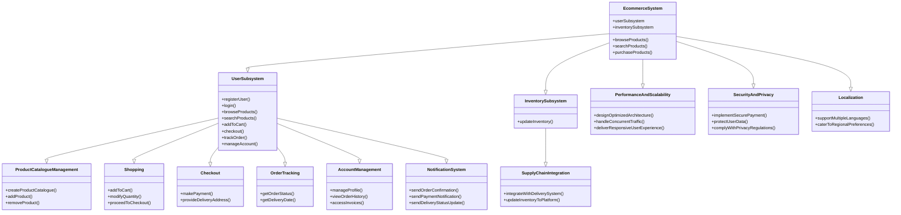
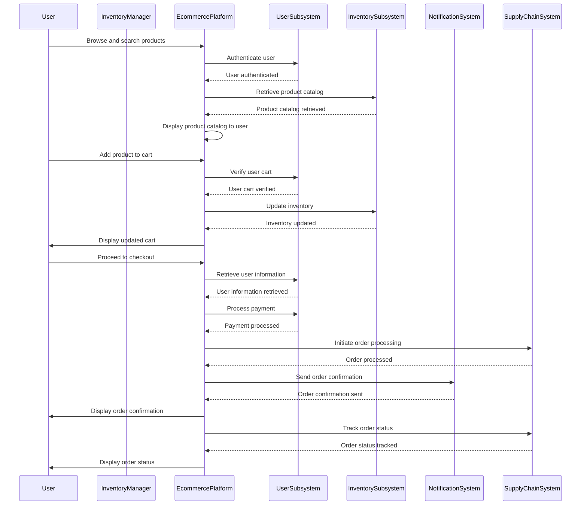

# E-Commerce Application

*ARCHITECTURALLY SIGNIFICANT REQUIREMENT DOCUMENT*

  

## Introduction

  

### Documentation Purpose and Scope

  

The ecommerce system provides a platform for conducting sales of a wide variety of goods and provides a way of bringing inventory management and customers on an online platform to conduct transactions in a secure manner across the globe. It is implemented as an online enterprise. This system provides an avenue for customers to shop from a wide variety of products online. It also provides a platform where they can update their inventory to the system for customers to view and purchase. The biggest advantage of the service is the comfort it brings with remote usage. The ability to compare various price ranges, brands and even customer reviews and experiences provides for a more honest/depth understanding.

  

The vision of the ecommerce system is to be able to provide a smooth and user-friendly platform for customers to select from a wide range of products conveniently and purchased and to cater to the needs of both customers and inventory manager.

  

### Product Perspective:

  

The system includes the user subsystem as well the inventory subsystem. The ecommerce platform provides an outstanding way of bringing and customers on an online platform to make purchases in an efficient and secure manner irrespective of the distance between the two. It is a platform for customers to shop items online without having to visit a store physically, and a platform for inventory manager to sell their items online without having to meet the customers physically or have a physical store set up for his products. This system is a one stop for customers to shop from millions of products online. The inventory manager uploads his listing to the system and the customers browse from these items and purchase them.

  

## Product Scope:

  

**Platform Development**

  

Develop a web-based e-commerce platform that allows customers to browse and purchase furniture and appliances online. The ecommerce system provides a platform for conducting sales of a wide variety of goods and provides a way of bringing inventory management and customers on an online platform to conduct transactions in a secure manner across the globe. It is implemented as an online enterprise.

  

**User Registration and Authentication**

  

Implement a user registration and authentication system to allow users to create accounts, log in, and securely access the platform.

  

**Product Catalogue Management**

  

Create a searchable product catalogue with categories, allowing users to browse and search for specific furniture and appliances. The ability to compare various price ranges, brands and even customer reviews and experiences provides for a more honest/depth understand. The vision of the ecommerce system is to be able to provide a smooth and user-friendly platform for customers to select from a wide range of products conveniently and purchased and to cater to the needs of both customers and inventory manager.

  

**Shopping Cart Functionality**

  

Develop a shopping cart feature that enables users to add products, modify quantities, and proceed to checkout. This system provides an avenue for customers to shop from a wide variety of products online.

  

**Checkout and Payment**

  

Implement a secure and user-friendly checkout process, allowing customers to provide delivery addresses and make payments online or through cash on delivery (COD).

  

**Order Tracking**

  

Develop a real-time order tracking system that provides updates to customers regarding the status and delivery date of their orders.

  

**Account Management**

  

Include functionality for users to manage their profiles, view order history, and access invoices.

  

**Notification System**

  

Implement a notification system to send timely updates to customers, such as order confirmations, payment notifications, and delivery status updates.

  

**Integration with Supply Chain**

  

Integrate the platform with the existing delivery and supply chain management systems to facilitate order processing and fulfilment. It also provides a platform where they can update their inventory to the system for customers to view and purchase. The biggest advantage of the service is the comfort it brings with remote usage.

  

**Performance and Scalability**

  

Design and optimize the architecture to ensure the platform can handle concurrent user traffic, a growing product catalogue, and deliver responsive user experiences.

  

**Security and Privacy**

  

Implement security measures, including secure payment processing, user data protection, and adherence to data privacy regulations.

  

**Localization**

  

Support multiple languages and regional preferences to cater to users from different regions and enhance their shopping experience.

  

## Intended Audience

  

**Business Owners and Management**

  

The project stakeholders who have initiated the project and hold the responsibility for its success. They would be interested in understanding how the platform will align with the business goals and contribute to its growth.

  

**Product Managers**

  

Individuals responsible for overseeing the development and delivery of the e-commerce platform. They need to be familiar with the project scope, requirements, and progress to ensure that the platform meets the desired functionality and objectives.

  

**Software Architects**

  

Architects who are responsible for designing the system's architecture and ensuring its scalability, security, and performance. They would be interested in the architectural aspects and decisions related to the platform development.

  

**Developers and Engineers**

  

The development team involved in building the e-commerce platform. They need to have a clear understanding of the project scope to guide their coding, implementation, and testing activities.

  

**Quality Assurance/Testers**

  

Individuals responsible for testing the platform to ensure its functionality, usability, and performance meet the defined requirements. They need to be aware of the project scope to design effective test cases and validate the platform against the specified criteria.

  

**User Experience (UX) Designers**

  

Designers responsible for creating an intuitive and user-friendly interface. They should be aware of the project scope to align the user experience with the intended goals and requirements.

  

  

## Business Context

  

The business context for the e-commerce platform development project can be described as follows:

  

**Business Overview**

  

The company is a new start-up operating in the Indian region, primarily engaged in selling furniture and appliances through offline channels. They have an established delivery and supply chain infrastructure in place.

  

**Expansion into Online Space**

  

The company aims to expand its operations in the online space by developing an e-commerce platform. The platform will allow customers to purchase a variety of products, including furniture and appliances, online.

  

**Objective**

  

The primary objective is to establish a user-friendly e-commerce platform that enables customers to browse, select, and purchase products online, leveraging the company's existing delivery and supply chain capabilities.

  

**Reducing Dependence on Offline Channels**

  

The company seeks to decrease reliance on traditional offline channels and reduce the costs associated with commission fees charged by existing marketplaces.

  

**Simplicity and Timely Deliveries**

  

The company wants to avoid overloading the platform with excessive features such as wallets and coupons to ensure a streamlined user experience and prevent any delays in order processing and delivery.

  

**Target Customer Base**

  

The platform will cater to customers residing in Tier 2 and Tier 3 cities in India. The availability of delivery services in specific pin codes will be communicated to users as necessary.

  

Overall, the business context highlights the company's desire to establish an independent e-commerce platform that enables customers to conveniently purchase furniture and appliances online. The emphasis is on simplicity, timely deliveries, and leveraging the existing delivery and supply chain infrastructure to expand the company's reach in the online market.

  

## Stakeholders

  

The stakeholders for the e-commerce platform development project can include:

  

**Business Owners and Management**

  

The individuals who have a vested interest in the success of the project, as they are responsible for the overall business strategy, investment decisions, and project governance.

  

**Product Managers**

  

Individuals who are accountable for overseeing the development of the e-commerce platform, aligning it with business goals, and ensuring it meets the needs of the target market.

  

**Software Architects**

  

Architects responsible for designing the system's architecture, making technology decisions, and ensuring scalability, performance, and security of the platform.

  

**Developers and Engineers**

  

The development team tasked with building the e-commerce platform, including front-end and back-end developers, who will be responsible for coding, testing, and implementing the required functionality.

  

**Quality Assurance/Testers**

  

Individuals responsible for testing the e-commerce platform to ensure it meets quality standards, functions correctly, and provides a seamless user experience.

  

**User Experience (UX) Designers**

  

Designers who are involved in creating an intuitive and user-friendly interface for the e-commerce platform, focusing on usability, accessibility, and visual design.

  

**Supply Chain and Logistics Managers**

  

Individuals responsible for managing the company's supply chain and logistics operations. They will be involved in integrating the e-commerce platform with existing systems to ensure smooth order processing and timely deliveries.

  

**Customer Support Representatives**

  

Representatives who will handle customer inquiries, order issues, and provide support through various channels such as chat, email, or phone.

  

**End Users**

  

The ultimate users of the e-commerce platform—customers who will visit the website, browse products, make purchases, and interact with the platform. Their feedback and satisfaction are essential for the success of the project.

  

It is important to identify and engage these stakeholders throughout the project to gather requirements, ensure alignment with business objectives, obtain feedback, and address any concerns or issues that may arise during the development process.

  

## Technical Constraints

  

The technical constraints for the e-commerce platform development project can include:

  

**Technology Stack**

  

The project may have constraints related to the selection of technology stack or platforms to be used for development. These constraints could be influenced by existing infrastructure, organizational preferences, compatibility requirements, or third-party integrations.

  

**Scalability**

  

The platform should be designed to handle increasing user traffic and a growing product catalogue. Scalability constraints may include considerations for database performance, server load balancing, caching mechanisms, and horizontal or vertical scaling options.

  

**Performance**

  

The platform should be designed to deliver optimal performance to ensure fast response times, quick page load times, and smooth user interactions. Constraints related to performance may involve optimizing code, database queries, network latency, and minimizing resource usage.

  

**Security**

  

The e-commerce platform must adhere to industry-standard security practices to protect user data, prevent unauthorized access, and safeguard against potential threats such as data breaches or injection attacks. Constraints may include using encryption, secure authentication mechanisms, and implementing security protocols.

  

**Integration with Third-Party Systems**

  

The platform may need to integrate with external systems such as payment gateways, inventory management systems, or customer relationship management (CRM) software. Constraints can arise from compatibility requirements, API availability, data synchronization, and maintaining data integrity during integration.

  

**Mobile Responsiveness**

  

The e-commerce platform may require mobile responsiveness to ensure a seamless user experience across various devices and screen sizes. Constraints may include designing responsive layouts, optimizing images and media, and ensuring compatibility with different mobile platforms and browsers.

  

**Data Management**

  

Constraints related to data management may include data storage, retrieval, and backup mechanisms. Compliance with data privacy regulations, data encryption, and proper handling of personally identifiable information (PII) may also impose constraints.

  

**Cross-Browser Compatibility**

  

The e-commerce platform should be compatible with popular web browsers to ensure consistent functionality and appearance across different browser versions and platforms. Constraints may involve testing and resolving any compatibility issues that arise.

  

**Localization**

  

If the platform is intended to serve customers from different regions or countries, constraints related to localization may include support for multiple languages, currencies, and regional preferences.

  

**Development Time and Resource Constraints**

  

The project may have limitations on development time, available resources, or budget. These constraints can influence the scope, prioritization of features, and overall development timeline.

  

## Business Constraints

  

The business constraints for the e-commerce platform development project can include:

  

**Budget**

  

The availability of financial resources allocated to the project can impose constraints on the scope, timeline, and resources available for development.

  

**Timeframe**

  

The project may have specific time constraints, such as a desired launch date or market opportunity window, which can impact the development timeline and prioritization of features.

  

**Resource Availability**

  

Constraints related to the availability of skilled personnel, development teams, or external vendors can impact the project's execution and may require adjustments to the scope or timeline.

  

**Legal and Regulatory Compliance**

  

The e-commerce platform must adhere to applicable laws, regulations, and industry standards, such as consumer protection, data privacy, and taxation requirements. Compliance constraints may influence the design, functionality, and operational aspects of the platform.

  

**Competitive Landscape**

  

The business may face constraints imposed by the competitive market landscape. These constraints can include the need to differentiate from competitors, offer unique features or pricing strategies, and respond to market trends or customer demands.

  

**Existing Infrastructure**

  

Constraints can arise from the need to integrate the e-commerce platform with existing systems, databases, or infrastructure. Compatibility and interoperability considerations may need to be addressed to ensure a seamless transition and minimize disruptions to the business operations.

  

**Customer Expectations**

  

The platform should meet the expectations of the target customers in terms of usability, convenience, and functionality. Understanding customer needs and aligning the platform with their expectations may impose constraints on the design and development process.

  

**Brand Identity**

  

The e-commerce platform should align with the brand identity, values, and positioning of the business. Constraints related to branding guidelines, visual design, and user experience may need to be considered during the development process.

  

**Operational Considerations**

  

Constraints related to operational aspects, such as inventory management, order fulfilment, customer support, and supply chain logistics, may need to be taken into account to ensure the platform can effectively support the business operations.

  

**Vendor or Partner Constraints**

  

If the business relies on third-party vendors or partners for specific services, constraints may arise from their capabilities, availability, pricing models, or contractual agreements.

  

Understanding and addressing these business constraints is crucial for successfully delivering an e-commerce platform that aligns with the business goals, meets customer expectations, and operates within the defined limitations.

  

## Quality attribute requirements

  

Quality attribute requirements, also known as non-functional requirements, describe the desired qualities and characteristics of the e-commerce platform beyond its core functionality. These requirements are essential for ensuring the platform's performance, usability, security, and other key aspects meet user expectations and business needs. Here are some examples of quality attribute requirements for the e-commerce platform:

  

**Performance**

  

The platform should have fast response times and quick page load speeds to provide a seamless user experience. For example, pages should load within a certain time limit (e.g., 2 seconds) across various devices and network conditions.

  

**Scalability**

  

The platform should be designed to handle increasing user traffic and a growing number of products without compromising performance. It should support horizontal and vertical scaling to accommodate future growth.

  

**Reliability**

  

The platform should be highly reliable, with minimal downtime and system failures. It should have a robust error-handling mechanism and graceful degradation in case of unexpected issues.

  

**Security**

  

The platform should adhere to industry-standard security practices to protect user data, prevent unauthorized access, and safeguard against potential threats such as data breaches and cyberattacks.

  

**Usability**

  

The platform should be intuitive and easy to use, ensuring that users can navigate through the website, search for products, and make purchases without confusion or frustration.

  

**Accessibility**

  

The platform should be accessible to users with disabilities, conforming to accessibility standards such as WCAG (Web Content Accessibility Guidelines).

  

**Compatibility**

  

The platform should be compatible with different web browsers, operating systems, and devices to provide a consistent experience to all users.

  

**Maintainability**

  

The platform should be designed and implemented in a way that facilitates easy maintenance, updates, and enhancements to accommodate future changes or new features.

  

**Data Integrity and Privacy**

  

The platform should ensure the integrity of user data, prevent data corruption, and protect user privacy by adhering to data privacy regulations and best practices.

  

**Performance under Load**

  

The platform should be tested for its ability to handle peak user loads without performance degradation. Load testing should be performed to assess its performance and scalability.

  

**Response Time for Payment Processing**

  

The payment processing system should have a defined response time for completing transactions, ensuring quick and efficient payment processing for customers.

  

**Order Fulfilment Time**

  

The time between order placement and delivery should be specified to manage customer expectations and ensure timely deliveries.

  

**Customer Support Response Time**

  

The expected response time for customer support inquiries and issue resolution should be defined to provide excellent customer service.

  

Each of these quality attribute requirements plays a critical role in shaping the overall user experience and performance of the e-commerce platform. By defining and adhering to these requirements, the platform can meet user expectations, gain customer trust, and contribute to the success of the business.

  

  

## Non-Functional Requirements

  

**The application has to run 24/7.**

  

To ensure that the application runs 24/7 without any downtime, we need to implement various DevOps practices and strategies.
- High Availability Architecture:
  - We are going to deploy the application on Kubernetes Cluster that provides high availability and redundancy
  - We will use load balancers to distribute incoming traffic among multiple instances of the application to ensure continuous availability even if some instances fail.
  - We will set up auto-scaling groups to automatically adjust the number of instances based on traffic demands, ensuring the application can handle varying loads.

- Fault Tolerance and Disaster Recovery:
  - We will set up redundant components, such as databases, web servers, and application servers, to ensure that if one component fails, the application can continue to function without interruptions.
  - We will implement automated backups and recovery procedures for critical data to avoid data loss in case of system failures.
  - We will establish a disaster recovery plan and test it regularly to ensure that the application can be restored quickly in the event of a catastrophic failure.
- Monitoring and Alerting:
  - We will implement a comprehensive monitoring system that tracks the health and performance of the application and infrastructure.
  - We will set up alerts and notifications to inform the operations team immediately if any critical issues arise or if any component becomes unavailable.
  - We will use Prometheus to monitor application metrics, server health, and resource utilization.
- Continuous Deployment and Rolling Updates:
  - We will utilize continuous integration with GitHub Action and continuous deployment (CI/CD) pipelines with Flux to automate the deployment process.
  - We will deploy updates to the application using rolling updates, where new versions of the application are gradually rolled out to instances to ensure that there is no downtime during updates.
- Infrastructure Automation and Configuration Management:
  - We will use infrastructure-as-a-code (IaaC) tools like Kubernetes to define and provision the infrastructure.
  - We will implement configuration management tool Ansible to ensure consistency and reproducibility of the application environment.
- Redundant Data Storage:
  - We will implement a redundant and distributed database setup to avoid single points of failure.
  - We will use database replication and clustering to ensure data availability and reliability.
- Regular Maintenance and Updates:
  - We will schedule regular maintenance windows to apply updates, patches, and security fixes to the application and infrastructure.
  - We will perform regular performance tuning and optimization to keep the application running smoothly.
- Global Load Balancing:
  - As the application will serve customers globally, we will consider implementing global load balancing to route traffic to the nearest available data center or region, reducing latency and improving response times for users in different parts of the world.

By following these practices and strategies, we can ensure that our will application runs 24/7 with high availability, minimal downtime, and a robust disaster recovery plan to handle any unforeseen issues. Continuous monitoring and automation play a vital role in maintaining the application's availability and ensuring a seamless experience for users.

**There will be 50k-100k DAU and around 30-40million MAU.**

To handle the expected daily active users (DAU) and monthly active users (MAU) in the range of 50,000 to 100,000 DAU and 30 to 40 million MAU, we need to focus on scalability, performance, and high availability of the web application.
- Horizontal Scaling:
  - We will use auto-scaling groups or serverless scaling configurations to automatically add or remove instances based on traffic demand.
  - We will define scaling policies to trigger scaling events when specific thresholds are reached (e.g., CPU utilization, network traffic).
- Caching and Content Delivery:
  - We will implement caching mechanisms at different levels (e.g., database caching, content caching) to reduce the load on the backend systems and improve response times.
  - We will utilize Content Delivery Networks (CDNs) to cache and serve static assets (e.g., images, CSS, JavaScript) from edge locations close to the users.
- Performance Optimization:
  - We will conduct regular performance testing to identify and optimize bottlenecks in the application.
  - We will optimize the database queries and use indexing to improve database performance.
  - We will minimize the number of HTTP requests and optimize page loading times to enhance user experience.
 - Database Scaling:
   - We will use a scalable database solution that can handle the expected traffic, such as a managed database service or a distributed NoSQL database.
   - We will implement database sharding or partitioning to distribute data across multiple servers for improved scalability.

**There will be average 5-7k orders placed in the day.**

To address the requirement that there will be an average of 5,000 to 7,000 orders placed per day, we need to focus on optimizing the application's performance, scalability, and reliability.
- Performance Optimization:
  - Identify performance bottlenecks in the application through load testing and performance monitoring.
  - We will use JMeter to simulate the expected load and measure the application's response times and throughput.
  - Optimize database queries and index data to ensure efficient retrieval of order-related information.
  - Implement caching mechanisms to reduce the load on the database and improve response times. Will use Redis to cache frequently accessed data.
  - Optimize the front-end to minimize the time taken to render pages and improve the user experience.
- Scalability:
  - Utilize horizontal scaling to handle increased load during peak times. Implement auto-scaling groups that automatically add or remove instances based on traffic demand.
  - Auto-scaling features to handle varying workloads.
  - Optimize the application architecture to be distributed and scalable, allowing it to handle the expected number of orders.
- Reliability and Availability:
  - Implement redundancy by deploying the application across multiple availability zones or regions to ensure high availability and fault tolerance.
  - Load balancers to distribute incoming requests among multiple instances to prevent overloading any single instance and to ensure the application remains available even if one instance fails.
  - Automated backup and disaster recovery mechanisms to protect against data loss and ensure business continuity.
- Database Optimization:
  - Use an appropriate database solution that can handle the expected number of orders and transactions efficiently. Consider using relational databases.
  - Optimize database schema and indexes for efficient storage and retrieval of order data.
  - Consider sharding or partitioning the database to distribute the data and queries across multiple servers.
- Continuous Monitoring:
  - Real-time monitoring of application performance and resource utilization. Set up alerts to notify the team of any abnormal behaviour or performance degradation.
  - ELK management solutions to aggregate and analyze logs, helping to troubleshoot issues and identify areas for improvement.
- Performance Testing:
  - Regularly perform load testing and performance testing to validate that the application can handle the expected number of orders.
  - Conduct stress testing to determine the application's breaking points and ensure it can handle traffic spikes.

By addressing these aspects, the web application can efficiently handle the expected number of daily orders, ensuring a smooth and reliable shopping experience for customers.

**Each order completion should take max 2 seconds.**

To ensure that each order completion takes a maximum of 2 seconds, we need to focus on optimizing the entire order processing flow.

- Optimize Database Queries:

	- Ensure that the database queries used during the order processing are efficient and well-optimized.

	- Use database indexes to speed up read and write operations.

	- Consider de-normalizing data or using caching mechanisms to reduce database load.

  

- Asynchronous Processing:

	- Use asynchronous processing for non-time-critical tasks, such as sending order confirmation emails or updating inventory status.

	- Queue these tasks using Apache Kafka message brokers to offload processing from the main order flow.

	  

- Distributed Systems:

	- Design the application as a distributed system, where different components can work independently and communicate via APIs.

	- Consider using microservices architecture to scale different parts of the order processing flow independently.

	  

- Optimize API Calls:
	
	- Optimize external API calls, such as payment gateways or inventory management systems, to reduce response times.

	- Use connection pooling and caching for frequently used APIs.

  

- Parallel Processing:

	- Identify parts of the order processing flow that can be executed in parallel and leverage multi-threading or asynchronous processing.

	- Use concurrent programming techniques to handle multiple tasks simultaneously.

	  

- Load Testing:

	- Perform load testing to simulate a high number of concurrent orders and identify potential bottlenecks.

	- Use load testing tool JMeter to measure the system's response time under different load conditions.

	  

- Optimize Code Execution:

	- Profile and optimize critical sections of the code to reduce execution time.

	- Use performance profiling tools to identify hotspots and areas for optimization.

	  

- Caching:

	- Implement caching mechanisms for frequently accessed data to reduce the need for repeated calculations or database queries.

	- Use in-memory caching solution Redis for faster data retrieval.

	  

- Hardware and Network Infrastructure:

	- Choose high-performance servers and infrastructure to handle the expected load and traffic.

	- Optimize the network infrastructure to reduce latency and response times.

	  

- Continuous Monitoring and Optimization:
	
	- Continuously monitor system performance and response times in real-time.

	- Use automated monitoring tools to detect anomalies and respond to performance degradation promptly.

By applying these strategies and conducting thorough testing, we can optimize the order completion process and ensure that each order is processed within the specified time frame of 2 seconds or less.

  

**Any search operation on the app should take max 1 seconds**

  

To ensure that any search operation on the app takes a maximum of 1 second, you can implement various performance optimization techniques.

  

- Use Indexing:

	- Ensure that the database tables used for searching are properly indexed.

	- Indexing allows the database to retrieve data more efficiently, reducing search times.

	  

- Optimize Database Queries:

	- Optimize the search queries to retrieve only the necessary data.

	- Specific WHERE clauses to filter results and avoid retrieving unnecessary information.

  

- Implement Caching:

	- Use caching mechanisms to store frequently accessed search results in memory.

	- This reduces the need to query the database repeatedly for the same search requests.

  

- Use Search Engine:

	- Depending on the complexity of your search requirements, consider using a dedicated search engine like Elasticsearch.

	- These search engines are designed for fast and efficient search operations.

	  

- Limit Search Results:

	- Limit the number of search results displayed to users.

	- This can help reduce the time taken to retrieve and render search results.

	  

- Asynchronous Processing:

	- For more complex search operations, consider using asynchronous processing.

	- Instead of making the user wait for the search results, return an acknowledgment to the user immediately and process the search in the background.

	- Notify the user when the search is complete.

- Load Testing:

	- Perform load testing to simulate high search traffic and identify any bottlenecks.

	- This helps us understand how our application performs under different levels of load and ensures that it meets the 1-second search time requirement.

	  

- Monitor Performance:

	- Continuously monitor the performance of search operations in production.

	- Use monitoring tools to track response times and identify any performance degradation.

  

- Optimize Frontend:

	- Optimize the frontend of the application to minimize rendering time.

	- Use lazy loading techniques for images and components to improve the overall user experience.

  

- Use CDN:

	- As our application will serve content globally, will consider using a Content Delivery Network (CDN) to cache and serve static search results from edge locations, reducing latency for users in different regions.

  

By following these best practices and continuously optimizing the search functionality, we can ensure that any search operation on the app meets the 1-second response time requirement, providing a smooth and efficient user experience.

  

**The app has to be always up and running without any downtime increase of disaster.**

  

To ensure that the web application is always up and running without any downtime, even in the event of a disaster, you can implement the following strategies and practices:

  

- High Availability Architecture:

  

	- Set up a highly available architecture with multiple instances of the application deployed across different availability zones or regions. This ensures redundancy and minimizes the impact of failures in one zone or region.

	- Use load balancers to distribute incoming traffic across multiple instances, allowing seamless failover if one instance becomes unavailable.

- Auto Scaling:

	- Implement auto-scaling based on traffic demand to automatically add or remove instances based on workload. This helps handle varying traffic and ensures the application can handle increased load during peak times or special events.

- Fault Tolerance:

	- Use microservices architecture to isolate different components of the application, making it easier to recover from failures in specific services without affecting the entire application.

	- Implement retry mechanisms for critical operations to handle transient failures in the system.

- Disaster Recovery Plan:

	- Set up a disaster recovery plan that includes regular backups of the application data and databases.

	- Replicate data to a secondary location in a different region to ensure data recovery in case of a catastrophic failure in the primary region.

- Monitoring and Alerting:

	- Implement a robust monitoring system that tracks application performance, resource utilization, and availability.

	- Set up proactive alerts to notify the operations team of any potential issues or anomalies, enabling them to take immediate action.

- Continuous Deployment:
	
	- Use continuous deployment practices to quickly release updates and bug fixes, reducing the time between identifying an issue and deploying a resolution.

- Ramped Deployment Strategy:

	- We will use the Ramped Deployment Strategy while deploying new features. It is also known as the Incremental Deployment Strategy or Phased Deployment. This strategy aims to reduce the risk of deployment by rolling out changes incrementally, allowing developers to monitor and validate each phase before moving on to the next.

	- Overall, the Ramped Deployment Strategy is a valuable approach for ensuring a smooth and controlled deployment process, reducing risks, and enhancing the overall user experience with the application.

- Redundant Database Setup:

	- Use redundant database setups, such as database replication, to ensure data availability even if one database node fails.

- Automated Recovery:

	- We will implement automated recovery procedures to automatically restart failed instances or services, reducing the impact of failures on the overall application.

	  

By adopting these strategies and practices, we can significantly improve the uptime and availability of the web application, ensuring it remains operational even in the face of disasters or unexpected failures.

  

**There will be some sale days in the month when the traffic will be spiked from took DAU to 120-150k users.**

  

To handle the spike in traffic during sale days when the number of daily active users (DAU) increases to 120-150k, you can implement the following strategies:

  

- Auto-scaling:

	- We will set up auto-scaling policies for your web application's infrastructure. During normal days, the application can run on a minimal number of instances to save costs. However, when the traffic increases during sale days, the auto-scaling policies will automatically add more instances to handle the increased load. This ensures that your application can handle the surge in traffic without manual intervention.

- Load Testing and Performance Optimization:

	- Conduct load testing in advance to identify the performance bottlenecks in your application. Optimize your code, database queries, and caching mechanisms to ensure the application can handle the expected load during the sale days.

- CDN and Caching:

	- Use Content Delivery Networks (CDNs) to cache and serve static assets like images, CSS, and JavaScript from edge locations. This reduces the load on your web servers and improves response times. Implement caching mechanisms for dynamic content to reduce the load on our database.

- Asynchronous Processing:

	- Offload resource-intensive tasks to background jobs or queues. For example, if certain processes are not time-sensitive, we can queue them for processing later instead of executing them synchronously during the sale days.

- Feature Toggling:

	- Use feature toggles to enable or disable certain features of your application during peak times. You can disable non-essential features or limit access to certain functionalities to manage the load effectively.

- Pre-warming:
	
	- Pre-warm our cache and infrastructure before the sale starts. This involves loading frequently accessed data into the cache and ensuring that additional instances are already running before the traffic surge.

- Proactive Monitoring:

	- Implement proactive monitoring and alerting to detect any anomalies or performance issues in real-time. This allows us to identify and resolve issues quickly, reducing the impact on users during peak times.

- Load Balancing:

	- We will use load balancers to distribute incoming traffic among multiple instances. This helps evenly distribute the load and prevent any single instance from becoming overwhelmed.

- Disaster Recovery Plan:

	- We will have a disaster recovery plan in place to handle any unforeseen issues during the sale days. This includes regular backups, redundant systems, and a plan for rolling back changes if needed.

  

By implementing these strategies, we can ensure that our web application can handle the increased traffic during sale days without any downtime or performance degradation, providing a smooth and seamless shopping experience for our users.

  

**The app has to globally serve the customers across the globe and the catalogue will be different for different countries.**

  

To solve the requirement of globally serving customers across the globe with different catalogues for different countries, we will follow these steps:

  

- Multi-Region Deployment:

	- Deploy the application in multiple regions using AWS. Each region should have its own set of servers, databases, and other necessary resources to handle user requests.

- Content Delivery Network (CDN):

	- Implement a CDN to cache and serve static assets (e.g., images, CSS, JS files) from edge locations close to the users. This reduces latency and improves the loading speed of the application for customers in different countries.

- Geo-Location Based Routing:

	- Use a geo-location based routing mechanism to direct user requests to the nearest data center or server. This ensures that customers are served from the region closest to their physical location, reducing response time.

- Internationalization (i18n) and Localization (l10n):

	- Implement i18n and l10n to support multiple languages and currencies based on user preferences. Detect the user's locale and present the appropriate version of the catalogue for their country and language.

- Country-Specific Catalogue Management:

	- Maintain separate catalogues or product databases for each country. The application should fetch the relevant catalogue based on the user's country or region.

- Currency Conversion:

	- Implement currency conversion for prices displayed to users in different countries. Use up-to-date exchange rates to dynamically convert prices to the user's preferred currency.

- Local Payment Gateways:

	- Integrate with local payment gateways and support payment methods commonly used in each country. This ensures that customers can make payments using familiar and preferred methods.

- Regional Compliance:

	- Ensure that the application complies with the data privacy regulations and legal requirements of each country where it operates.

  

By implementing these strategies, the application can effectively serve customers across the globe with a personalized and localized shopping experience, tailored to the preferences and needs of users in different countries.

  

**All the payments and user data should be securely stored and accessed.**

  

To ensure that all payments and user data are securely stored and accessed, you can implement several security measures in your web application development process. Here are some key steps to address this requirement:

  

- Encryption:

	- Use strong encryption algorithms (e.g., AES-256) to encrypt sensitive data such as passwords, payment details, and personal information.

	- Employ transport layer security (TLS) to encrypt data in transit, ensuring secure communication between the user's browser and the server.

	  

- Secure Authentication:

	- Implement secure authentication mechanisms, such as multi-factor authentication (MFA), to prevent unauthorized access to user accounts.

	- Store user passwords using strong hashing algorithms (e.g., bcrypt) with salting to protect against password attacks.

	  

- Role-Based Access Control (RBAC):
	
	- Implement RBAC to control access to different parts of the application based on user roles and permissions.

	- Limit access to sensitive data and functions only to authorized personnel.

	  

- Data Privacy Compliance:

	- Comply with relevant data privacy regulations, such as GDPR or CCPA, to protect user data and privacy rights.

	- Obtain explicit consent from users before collecting and processing their personal data.

	  

- Secure Payment Gateway Integration:

	- Use trusted and PCI DSS-compliant payment gateways to handle payment transactions securely.

	- Avoid storing sensitive payment information on your server and rely on tokenization provided by the payment gateway.

  

- Regular Security Audits and Penetration Testing:

	- Conduct regular security audits and vulnerability assessments to identify and address potential security weaknesses.

	- Perform penetration testing to simulate real-world attacks and validate the effectiveness of your security measures.

  

- Data Access Controls:

	- Implement strict access controls to limit the number of personnel who can access sensitive data.

	- Use secure protocols for remote access, such as VPN, and implement IP whitelisting to restrict access to authorized locations.

	  

- Secure Coding Practices:

	- Train your development team in secure coding practices to avoid common vulnerabilities like SQL injection, cross-site scripting (XSS), and cross-site request forgery (CSRF).

	- Use security libraries and frameworks to prevent security flaws.

	  

- Regular Security Updates:

	- Keep all software, libraries, and dependencies up to date with the latest security patches.

	- Implement a process to quickly respond to security advisories and apply patches promptly.

	  

- Data Backup and Disaster Recovery:

	- Regularly back up user data and store it securely in multiple locations to ensure data recovery in case of any disasters or data breaches.

	  

By incorporating these security measures, you can establish a robust security posture for your web application, safeguarding user data and ensuring secure payment processing for your customers. It's crucial to continually review and update your security practices to stay ahead of emerging threats and maintain a secure environment for your users.

## Repository branching strategy:

### Gitflow Branching Strategy:

Gitflow is a branching model that provides a structured approach to managing branches and releases.

**Main Branch:**

The main branch contains the production-ready code. It is always in a stable state and represents the latest released version of the software.

**Develop Branch:**

The develop branch is used as the integration branch for ongoing development work. Developers create feature branches from the develop branch and merge their changes back into it once the feature is complete.

**Feature Branches:**

Feature branches are created by developers from the develop branch. Each feature branch represents a single new feature or improvement. Once the feature is complete and tested, it is merged back into the develop branch.

**Release Branches:**

Release branches are created from the develop branch when the team is preparing for a new release. The release branch is used for final testing, bug fixing, and preparing the release. Once the release is ready, it is merged into both the main and develop branches.

**Hotfix Branches:**

Hotfix branches are used to address critical issues in the production code. They are created from the main branch and, once the fix is applied, merged back into both the main and develop branches.

The typical flow of work in the Gitflow branching strategy is as follows:

1. Developers create feature branches from the develop branch to work on new features or changes.

2. Once a feature is complete, it is merged back into the develop branch for integration testing.

3. When the team is preparing for a new release, a release branch is created from the develop branch.

4. The release branch undergoes final testing and bug fixing, and once it's ready, it is merged into both the main and develop branches.

5. If critical issues are discovered in the main branch, hotfix branches are created to address them. Once fixed, hotfixes are merged back into both the main and develop branches.

## DevOps Deployment strategy

We will be following the Ramped deployment strategy while deploying our code in production release.

### Ramped Deployment

Ramped deployment is a deployment strategy that focuses on gradually rolling out new releases or updates to a software system, rather than deploying them to all users at once. This strategy is also known as a phased or incremental deployment. The goal of ramped deployment is to minimize risks and disruptions associated with large-scale deployments by incrementally introducing changes and monitoring their impact on the system and users.

**Key Steps in Ramped Deployment Strategy:**

**Deployment Planning:**

The first step is to plan the deployment process. This involves defining the phases of deployment, determining the criteria for progressing to the next phase, and setting up monitoring and rollback mechanisms.

**Phases of Deployment:**

In a ramped deployment strategy, the deployment process is divided into multiple phases. Each phase includes a subset of users or systems to receive the new release.

**Initial Deployment:**

The initial phase involves deploying the new release to a small subset of users or systems. These users are often internal team members or a limited group of early adopters.

**Monitoring and Validation:**

During each phase of deployment, the system's performance, stability, and user feedback are closely monitored. This helps to identify any issues or unexpected behavior early on.

**Incremental Expansion:**

If the initial phase is successful and no critical issues are detected, the deployment is expanded to a larger subset of users or systems. This expansion continues gradually, increasing the number of users with each subsequent phase.

**Rollback Plan:**

It's crucial to have a rollback plan in place in case any severe issues arise during deployment. If problems are detected, the deployment can be rolled back to a previous version to minimize the impact on users.

**Steady State and Completion:**

The ramped deployment process continues until the new release is deployed to all users or systems. Once the deployment is complete, the system reaches a steady state, and further monitoring ensures that everything is functioning as expected.

**Benefits of Ramped Deployment:**

**Risk Mitigation:**

Ramped deployment reduces the risk associated with large-scale deployments. By gradually introducing changes, issues can be detected and resolved early, minimizing the impact on users.

**Continuous Monitoring:**

The deployment strategy allows for continuous monitoring of system performance and user feedback, ensuring that any issues are addressed promptly.

**User Feedback:**

Early deployment to a limited user group allows for valuable feedback, which can be used to make improvements before rolling out the update to a broader audience.

**Flexibility:**

The phased approach provides flexibility to adjust the deployment plan based on real-time feedback and observations during each phase.

**Improved User Experience:**

By monitoring and addressing issues early, ramped deployment aims to provide a smoother and more seamless user experience during the update process.

**Rollback Capability:**

Having a rollback plan ensures that if critical issues are encountered, the deployment can be quickly reverted to a previous stable version.

Ramped deployment is particularly useful for large, complex systems with a significant user base, as it helps ensure a smooth and successful update process while minimizing disruptions. It is a popular deployment strategy in scenarios where system reliability and user experience are critical considerations.

This strategy gives zero downtime and also enables performance monitoring. Nevertheless, the rollback duration is long in case there is an unexpected event. This is because the downgrading process to the initial version follows the same cycle, one instance at a time.

## C4 View:
### System Landscape View:

### Context View

### Container View

### Component View

### Code View
**Class Diagram**

## Sequence Diagram

### Deployment View (Development)

### Deployment View (Production)

## ER Diagram:

## Use Case

 

### User Registration

 

#### Scenario of Registration Process

·     User can enter FirstName, Middle Name, Last Name, Email Id, Phone Number, Password.

·     User can click on registration Button.

·     Validation can be done at front end and backend code.

·     If validation successfully done, then user can see registration success and login page link/button.

·     If validation failed, then user can see validation error message on registration page.

      

 

### User Login

 

#### Scenario of Login Process

·     User can enter Username and password, username can be email Id or Phone Number.

·     If user enter valid details, then he can see home page of ecommerce application.

·     If validation failed, user could see login failed error on Login page.

 

### User searches for products

 

#### Scenario: Successful product search

·     Given that the customer is on the home page

·     When the customer enters a valid search query for a product

·     Then the system should display a list of products that match the search query

·     And the displayed products should include the product name, image, price, and relevant details

·     And the displayed products should be relevant and accurately match the search query

 

#### Scenario: No matching results for the search query

·     Given that the customer is on the home page

·     When the customer enters a search query for a product that does not exist in the system

·     Then the system should display a message indicating that no matching products were found

·     And the system should not display any products in the search results

#### Scenario: Handling empty search query

·     Given that the customer is on the home page

·     When the customer performs a search without entering any search query

·     Then the system should display a message indicating that a search query is required

·     And the system should not perform a search or display any products in the search results

####  Scenario: Search results pagination

·     Given that the customer is on the home page

·     When the customer performs a search that returns a large number of results

·     Then the system should display the search results in a paginated manner, showing a limited number of products per page

·     And the system should provide navigation options for the customer to view additional pages of search results

 

#### Scenario: Search performance and response time

·     Given that the customer is on the home page

·     When the customer performs a search

·     Then the system should provide search results within an acceptable response time, typically within a few seconds

·     And the system should be able to handle concurrent searches and maintain performance under expected load

 

### User adds products to the cart

 

#### Scenario: Successful addition of a product to the cart

·     Given that the customer is viewing a product

·     When the customer selects the option to add the product to the cart

·     Then the system should update the cart to include the selected product

·     And the system should display a confirmation message indicating that the product has been successfully added to the cart

#### Scenario: Incrementing the quantity of an existing product in the cart

·     Given that the customer has already added a product to the cart

·     When the customer adds the same product again

·     Then the system should increment the quantity of the product in the cart

·     And the system should update the total price in the cart to reflect the increased quantity

#### Scenario: Displaying the updated cart summary

·     Given that the customer has added one or more products to the cart

·     When the customer views the cart summary

·     Then the system should display the list of products in the cart

·     And the system should show the individual prices, quantities, and total price for each product in the cart

·     And the system should provide options for the customer to modify or remove items from the cart

#### Scenario: Handling out-of-stock products

·     Given that the customer tries to add a product that is currently out of stock

·     When the customer attempts to add the out-of-stock product to the cart

·     Then the system should display a message indicating that the product is currently unavailable

·     And the system should not add the out-of-stock product to the cart

#### Scenario: Persisting the cart across sessions

·     Given that the customer has added products to the cart

·     When the customer logs out and logs back in

·     Then the system should retain the products in the cart and restore the cart contents for the logged-in customer

 

·     

### User checks out and places an order

#### Scenario: Successful checkout and order placement

·     Given that the customer has products in the cart

·     When the customer proceeds to the checkout process

·     Then the system should prompt the customer to provide the required delivery address

·     And the system should provide options for the customer to select a preferred payment method

·     And the system should validate and process the payment successfully

·     And the system should generate a unique order ID for the placed order

·     And the system should display a confirmation message indicating that the order has been successfully placed

#### Scenario: Handling empty cart during checkout

·     Given that the customer has not added any products to the cart

·     When the customer proceeds to the checkout process

·     Then the system should display a message indicating that the cart is empty

·     And the system should not allow the customer to proceed with the checkout process

#### Scenario: Required delivery address validation

·     Given that the customer is on the checkout page

·     When the customer provides the required delivery address information

·     Then the system should validate the provided address for completeness and correctness

·     And the system should display error messages or warnings if the address is incomplete or invalid

·     And the system should not allow the customer to proceed with the checkout process until a valid address is provided

#### Scenario: Payment processing and confirmation

·     Given that the customer has provided the required delivery address

·     When the customer selects a payment method and initiates the payment process

·     Then the system should securely process the payment transaction

·     And the system should display a payment confirmation message or receipt to the customer

·     And the system should send a notification to the customer regarding the payment status

#### Scenario: Order confirmation and tracking

·     Given that the customer has successfully placed an order

·     When the order is confirmed by the system

·     Then the system should display the order details, including the order ID, items purchased, total amount, and delivery information

·     And the system should send a confirmation email or notification to the customer with the order details and estimated delivery date

·     And the system should provide a tracking mechanism for the customer to track the status of the placed order

 

### User tracks an order

#### Scenario: Successful order tracking

·     Given that the customer has placed an order and received an order ID or tracking number

·     When the customer navigates to the order tracking page

·     Then the system should provide a field for the customer to enter the order ID or tracking number

·     And the system should display the current status and location of the order

·     And the system should provide estimated delivery dates or timeframes for each stage of the delivery process

·     And the system should update the tracking information in real-time or with a reasonable delay

#### Scenario: Invalid or non-existent order tracking

·     Given that the customer enters an invalid or non-existent order ID or tracking number

·     When the customer submits the tracking request

·     Then the system should display a message indicating that the entered order ID or tracking number is not valid or does not exist

·     And the system should not display any tracking information for the invalid order

#### Scenario: Tracking information availability

·     Given that the customer has placed an order recently

·     When the customer tries to track the order immediately after placing it

·     Then the system should display a message indicating that the tracking information is not available yet

·     And the system should provide an estimated timeframe or expected time for the tracking information to become available

#### Scenario: Detailed order status and history

·     Given that the customer is tracking an order

·     When the customer views the order tracking details

·     Then the system should display a comprehensive view of the order status, including the current location, transit history, and expected delivery date

·     And the system should provide any relevant updates or notifications regarding the order, such as delays or changes in the delivery schedule

#### Scenario: Multiple order tracking

·     Given that the customer has placed multiple orders

·     When the customer wants to track multiple orders simultaneously

·     Then the system should provide a mechanism for the customer to enter multiple order IDs or tracking numbers at once

·     And the system should display the tracking information for all the entered orders in a consolidated view

 

### User views order history

#### Scenario: Successful access to order history

·     Given that the customer is logged into their account

·     When the customer navigates to the order history page

·     Then the system should display a list of previous orders placed by the customer

·     And the system should show the order details, including the order ID, items purchased, total amount, and delivery information

·     And the system should display the orders in reverse chronological order, with the most recent order appearing at the top

#### Scenario: Filtering or sorting order history

·     Given that the customer is viewing the order history page

·     When the customer wants to filter or sort the order history

·     Then the system should provide options for the customer to filter or sort the orders based on criteria such as date, status, or product category

·     And the system should update the order history view accordingly, displaying only the orders that match the selected filter or sorting criteria

#### Scenario: Order details and receipts

·     Given that the customer is viewing the order history

·     When the customer selects a specific order from the order history list

·     Then the system should display the detailed order information, including the order ID, items purchased, individual prices, quantities, and total amount

·     And the system should provide the option to view or download an order receipt or invoice in a printable format

#### Scenario: Order status and tracking from history

·     Given that the customer is viewing the order history

·     When the customer selects a specific order from the order history list

·     Then the system should display the current status of the order, such as "Processing," "Shipped," or "Delivered"

·     And the system should provide a link or button for the customer to track the order or access the order tracking details directly from the order history page

#### Scenario: Pagination and navigation of order history

·     Given that the customer has a large number of orders in their order history

·     When the customer views the order history page

·     Then the system should display the orders in a paginated manner, showing a limited number of orders per page

·     And the system should provide navigation options for the customer to move between pages of the order history

 

### User views invoice

#### Scenario: Successful access to invoice

·     Given that the customer is logged into their account

·     When the customer navigates to the invoice page or selects a specific order

·     Then the system should display the invoice for the selected order

·     And the system should show the invoice details, including the order ID, items purchased, individual prices, quantities, and total amount

·     And the system should include relevant information such as customer details, billing address, payment method, and any applicable taxes or discounts

#### Scenario: Printable and downloadable invoice

·     Given that the customer is viewing the invoice

·     When the customer wants to print or download the invoice

·     Then the system should provide a printable or downloadable version of the invoice in a suitable format (such as PDF or HTML)

·     And the system should ensure that the printable or downloadable invoice accurately represents the information displayed on the screen

#### Scenario: Invoice layout and formatting

·     Given that the customer is viewing the invoice

·     When the customer reviews the invoice layout and formatting

·     Then the system should present the invoice in a clear and organized manner

·     And the system should use appropriate formatting, such as headings, subtotals, and a total amount, to facilitate easy comprehension of the invoice details

#### Scenario: Handling invoice errors or discrepancies

·     Given that the customer notices errors or discrepancies in the displayed invoice

·     When the customer raises a concern or contacts customer support

·     Then the system should promptly investigate and resolve the issue

·     And the system should provide clear communication to the customer regarding the resolution and any necessary adjustments to the invoice

#### Scenario: Accessing historical invoices

·     Given that the customer wants to view previous invoices

·     When the customer navigates to the invoice history or order history page

·     Then the system should provide a list of previous orders with links to access the respective invoices

·     And the system should ensure that the invoices remain accessible even after a certain period of time or order completion

 

### Administrator manages products

#### Scenario: Adding a new product

·     Given that the Administrator is logged into their account

·     When the Administrator navigates to the product management section

·     Then the system should provide a form or interface to add a new product

·     And the system should validate and require essential information such as product name, description, price, and category

·     And the system should save the product details and assign a unique identifier or SKU

#### Scenario: Updating an existing product

·     Given that the Administrator is logged into their account

·     When the Administrator selects a specific product from the product list

·     Then the system should display the product details for editing

·     And the system should allow the Administrator to modify the product information, such as name, description, price, and category

·     And the system should save the updated product details and reflect the changes in the product list

#### Scenario: Removing a product

·     Given that the Administrator is logged into their account

·     When the Administrator selects a specific product from the product list

·     Then the system should provide an option or button to remove the product

·     And the system should prompt the Administrator for confirmation before permanently deleting the product

·     And the system should remove the product from the product list and any associated data or references

#### Scenario: Managing product categories

·     Given that the Administrator is logged into their account

·     When the Administrator navigates to the product category management section

·     Then the system should display the list of existing categories

·     And the system should allow the Administrator to add new categories or modify existing ones

·     And the system should ensure that categories are properly organized and associated with the relevant products

#### Scenario: Handling product images

·     Given that the Administrator is managing a product

·     When the Administrator uploads or modifies product images

·     Then the system should accept image files of specified formats and sizes

·     And the system should store and associate the images with the respective product

·     And the system should display the product images appropriately in the product listing and details pages

### Administrator manages orders

#### Scenario: Viewing order list

·     Given that the Administrator is logged into their account

·     When the Administrator navigates to the order management section

·     Then the system should display a list of orders, including relevant details such as order ID, customer name, order status, and total amount

·     And the system should provide pagination or scrolling functionality if the order list is extensive

#### Scenario: Filtering and sorting orders

·     Given that the Administrator is viewing the order list

·     When the Administrator wants to filter or sort the orders

·     Then the system should provide options to filter or sort the orders based on criteria such as order status, customer name, order date, or total amount

·     And the system should update the order list according to the selected filter or sorting criteria

#### Scenario: Updating order status

·     Given that the Administrator is viewing an order in the order list

·     When the Administrator wants to update the order status

·     Then the system should provide options to change the order status, such as marking it as "Processing," "Shipped," or "Delivered"

·     And the system should save and reflect the updated order status in the order list and order details

#### Scenario: Viewing order details

·     Given that the Administrator is viewing an order in the order list

·     When the Administrator selects a specific order

·     Then the system should display the order details, including customer information, product details, quantities, prices, and any applied discounts or taxes

·     And the system should provide a summary of the order, including the total amount and payment status

#### Scenario: Managing order fulfillment

·     Given that the Administrator is viewing an order in the order list

·     When the Administrator wants to manage order fulfillment, such as assigning it to a delivery person or updating delivery details

·     Then the system should provide options or fields to input and save the relevant information

·     And the system should ensure that the updated fulfillment details are reflected in the order details and any relevant notifications or updates are sent to the customer

#### Scenario: Generating order reports

·     Given that the Administrator wants to generate order reports

·     When the Administrator navigates to the reporting section or selects a specific reporting option

·     Then the system should generate and display relevant order reports, such as sales reports, order volume reports, or revenue reports

·     And the system should provide options to filter the reports based on criteria such as date range, product category, or customer segment

  

### Supplier manages inventory

#### Scenario: Viewing inventory

·     Given that the Supplier is logged into their account

·     When the Supplier navigates to the inventory management section

·     Then the system should display a list of available inventory items

·     And the system should show relevant details for each item, such as product name, SKU, quantity in stock, and location

#### Scenario: Updating inventory quantities

·     Given that the Supplier is viewing the inventory     

·     When the Supplier wants to update the quantity of a specific item

·     Then the system should provide options to adjust the quantity, such as adding or subtracting units

·     And the system should validate and update the inventory quantity accordingly

·     And the system should reflect the updated quantity in the inventory list and any associated reports or notifications

#### Scenario: Adding new inventory items

·     Given that the Supplier is logged into their account

·     When the Supplier wants to add a new item to the inventory

·     Then the system should provide a form or interface to enter the details of the new item, such as product name, SKU, quantity, location, and other relevant attributes

·     And the system should validate the entered information and save the new item in the inventory

#### Scenario: Removing inventory items

·     Given that the Supplier is viewing the inventory

·     When the Supplier wants to remove a specific item from the inventory

·     Then the system should provide options to delete the item

·     And the system should prompt the Supplier for confirmation before permanently removing the item from the inventory

·     And the system should update the inventory list and any associated records or reports to reflect the removal of the item

#### Scenario: Tracking inventory movement

·     Given that the Supplier wants to track the movement of inventory items

·     When the Supplier selects a specific item from the inventory list

·     Then the system should display a history of inventory transactions for that item, including details such as date, quantity, and location changes

·     And the system should provide options to filter and search the inventory movement history based on criteria such as date range or location

#### Scenario: Managing low stock or out-of-stock items

·     Given that the Supplier is viewing the inventory

·     When the Supplier wants to identify low stock or out-of-stock items

·     Then the system should highlight or provide filters to easily identify items with low quantities or no stock

·     And the system should allow the Supplier to set alerts or notifications for low stock levels to proactively manage inventory replenishment

 

### Supplier manages product catalogue

#### Scenario: Viewing the product catalogue

·     Given that the Supplier is logged into their account

·     When the Supplier navigates to the product catalogue management section

·     Then the system should display a list of products in the catalogue

·     And the system should show relevant details for each product, such as product name, SKU, description, and pricing information

#### Scenario: Adding a new product to the catalogue

·     Given that the Supplier is logged into their account

·     When the Supplier wants to add a new product to the catalogue

·     Then the system should provide a form or interface to enter the details of the new product, such as product name, SKU, description, category, pricing, and any other relevant attributes

·     And the system should validate the entered information and save the new product in the catalogue

#### Scenario: Updating an existing product in the catalogue

·     Given that the Supplier is viewing the product catalogue

·     When the Supplier selects a specific product from the catalogue

·     Then the system should display the product details for editing

·     And the system should allow the Supplier to modify the product information, such as name, description, category, pricing, or any other relevant attributes

·     And the system should save the updated product details and reflect the changes in the product catalogue

#### Scenario: Removing a product from the catalogue

·     Given that the Supplier is viewing the product catalogue

·     When the Supplier wants to remove a specific product from the catalogue

·     Then the system should provide options to delete the product

·     And the system should prompt the Supplier for confirmation before permanently removing the product from the catalogue

·     And the system should update the product catalogue and any associated records or reports to reflect the removal of the product

#### Scenario: Managing product images in the catalogue

·     Given that the Supplier is managing a product in the catalogue

·     When the Supplier wants to upload or modify product images

·     Then the system should accept image files of specified formats and sizes

·     And the system should store and associate the images with the respective product in the catalogue

·     And the system should display the product images appropriately in the catalogue listing and details pages

#### Scenario: Managing product categories

·     Given that the Supplier is managing a product in the catalogue

·     When the Supplier wants to assign or update the product category

·     Then the system should provide options to select the appropriate category from a predefined list

·     And the system should ensure that the product is properly categorized in the catalogue for easy navigation and search

